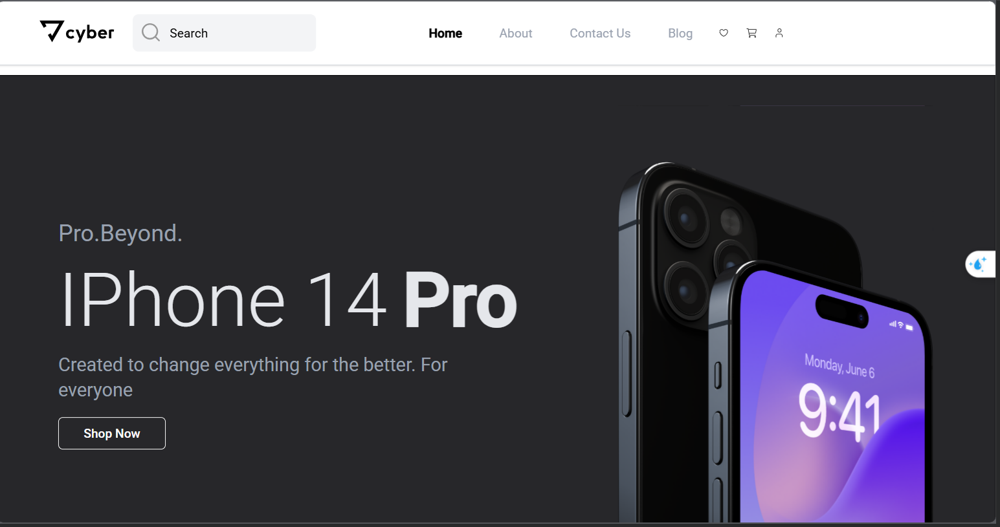
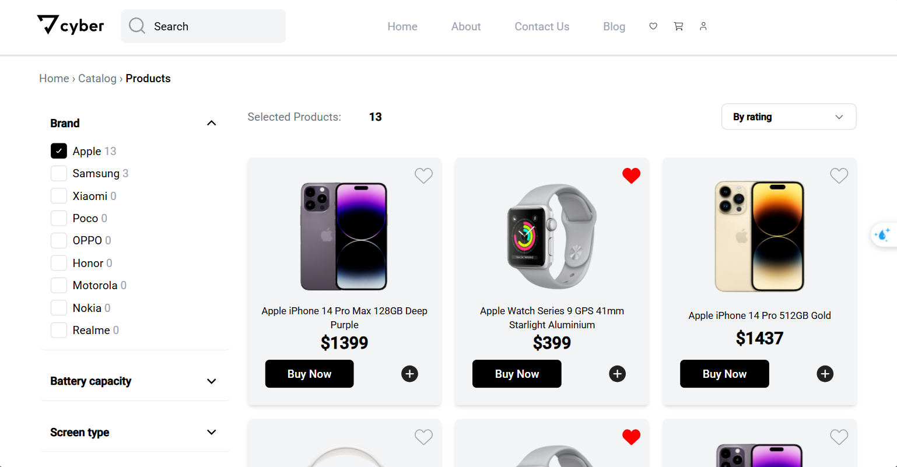
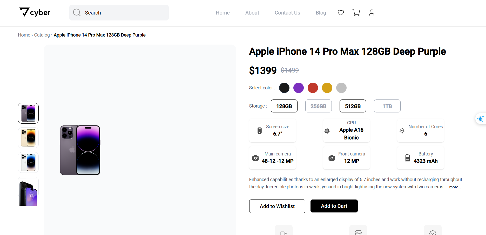
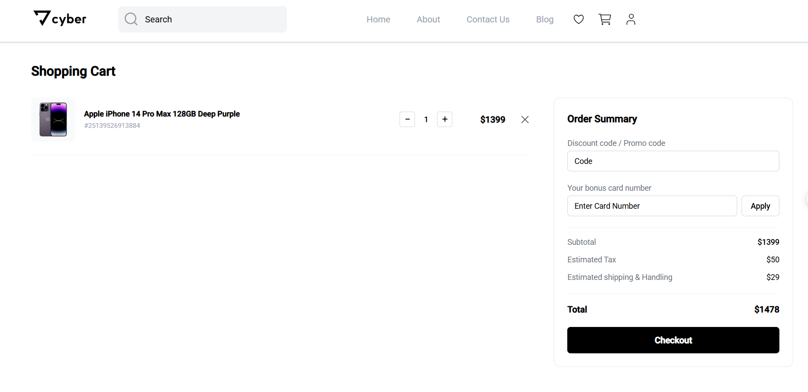
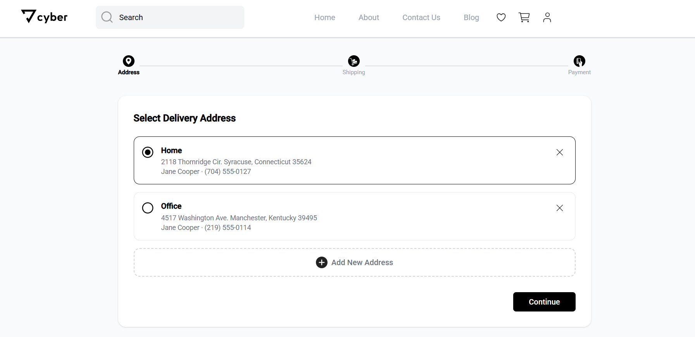
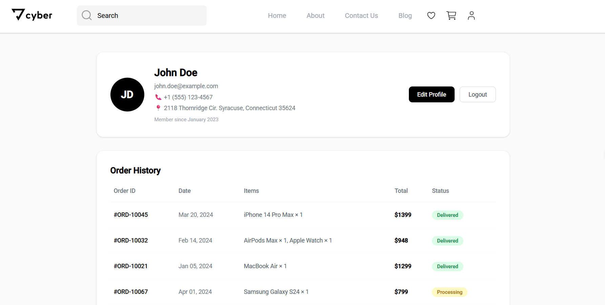

# 🛍️ EStore - Modern Angular E-Commerce

[](https://angular.io/)
[](https://tailwindcss.com/)
[](https://www.typescriptlang.org/)

A modern, fully responsive e-commerce web application built with **Angular 20** and **TailwindCSS**. Features product browsing, shopping cart, user authentication, wishlist, and a complete 3-step checkout process.

**Live Demo**: [View Demo](LINK) 

**Figma Design**: [View on Figma](https://www.figma.com/design/5upvOCYl6OSC9hWggYbka2/E-Store---Mobile-web--Community-?node-id=0-1&t=0iseTQUdZBbO48eE-0) 

---

## 📸 Screenshots

| Home Page | Products Page | Product Details |
|-----------|---------------|-----------------|
|  |  |  |

| Shopping Cart | Checkout | User Profile |
|---------------|----------|--------------|
|  |  |  |

> ** Screenshots folder**: Create `screenshots/` in project root and add images with names above.

---

## 🛠️ Tech Stack

| Category | Technology |
|----------|------------|
| **Frontend Framework** | Angular 20 (Standalone Components) |
| **Styling** | TailwindCSS v3+ |
| **State Management** | Angular Signals (`signal`, `computed`, `effect`) |
| **Change Detection** | OnPush Strategy |
| **Language** | TypeScript 5.x |
| **Linting** | ESLint + Angular ESLint |
| **Persistence** | LocalStorage |

---

## 🚀 Quick Start

```bash
# 1. Clone the repository
git clone https://github.com/your-username/e-store.git

# 2. Navigate to project
cd e-store

# 3. Install dependencies
npm install

# 4. Run development server
ng serve -o